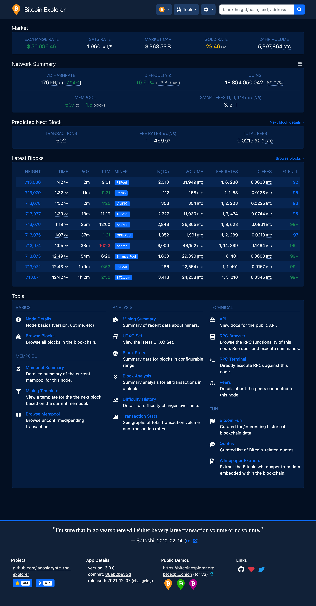

# BTC RPC Explorer

## Self-Hosted Widecoin explorer for everyone running [Widecoin Core](https://github.com/bitcoin/bitcoin).

[![npm version][npm-ver-img]][npm-ver-url] [![NPM downloads][npm-dl-alltime-img]][npm-dl-url]


---





This is a self-hosted explorer for the Widecoin blockchain, driven by RPC calls to your own [Widecoin](https://github.com/bitcoin/bitcoin) node. It is easy to run and can be connected to other tools (like Electrum servers) to achieve a full-featured explorer.

Whatever reasons you may have for running a full node (trustlessness, technical curiosity, supporting the network, etc) it's valuable to appreciate the *fullness* of your node. With this explorer, you can explore not just the blockchain database, but also explore all of the functional capabilities of your own node.

Live demos:

* [WidecoinExplorer.org](https://bitcoinexplorer.org) / [testnet](https://testnet.bitcoinexplorer.org) / [signet](https://signet.bitcoinexplorer.org)


# Features

* Network Summary dashboard
* View details of blocks, transactions, and addresses
* Analysis tools for viewing stats on blocks, transactions, and miner activity
* JSON REST API
* See raw JSON content from bitcoind used to generate most pages
* Search by transaction ID, block hash/height, and address
* Optional transaction history for addresses by querying from Electrum-protocol servers (e.g. Electrs, ElectrumX), blockchain.com, blockchair.com, or blockcypher.com
* Mempool summary, with fee, size, and age breakdowns
* RPC command browser and terminal


# Changelog / Release notes

See [CHANGELOG.md](/CHANGELOG.md).


# Getting started

## Prerequisites

1. Install `Widecoin Core` - [instructions](https://bitcoin.org/en/full-node). Ensure that `Widecoin Core`'s' RPC server is enabled (`server=1`).
2. Allow `Widecoin Core` to synchronize with the Widecoin network (you *can* use this tool while sychronizing, but some pages may fail).
3. Install Node.js (16+ required, 18+ recommended).

### Note about pruning and indexing configurations

This tool is designed to work best with full transaction indexing enabled (`txindex=1`) and pruning **disabled**. 
However, if you're running Widecoin Core v0.21+ you can run *without* `txindex` enabled and/or *with* `pruning` enabled and this tool will continue to function, but some data will be incomplete or missing. Also note that such Widecoin Core configurations receive less thorough testing.

In particular, with `pruning` enabled and/or `txindex` disabled, the following functionality is altered:

* You will only be able to search for mempool, recently confirmed, and wallet transactions by their txid. Searching for non-wallet transactions that were confirmed over 3 blocks ago is only possible if you provide the confirmed block height in addition to the txid.
* Pruned blocks will display basic header information, without the list of transactions. Transactions in pruned blocks will not be available, unless they're wallet-related. Block stats will only work for unpruned blocks.
* The address and amount of previous transaction outputs will not be shown, only the txid:vout.
* The mining fee will only be available for unconfirmed transactions.


## Install / Run

If you're running on mainnet with the default datadir and port, the default configuration should *Just Work*. Otherwise, see the **Configuration** section below.

#### Install via `npm`:

*Note: npm v7+ is required*

```bash
npm install -g btc-rpc-explorer
btc-rpc-explorer
```

#### Run from source:

1. `git clone https://github.com/janoside/btc-rpc-explorer`
2. `cd btc-rpc-explorer`
3. `npm install`
4. `npm start`


#### Install via AUR Arch Linux:

###### Note: The below AUR package was created and is maintained by [@dougEfresh](https://github.com/dougEfresh). The details and history of the package can be seen [here](https://aur.archlinux.org/packages/btc-rpc-explorer/).

1. `git clone https://aur.archlinux.org/btc-rpc-explorer.git`
2. `cd btc-rpc-explorer`
3. `makepkg -csi`
4. `systemctl enable --now btc-rpc-explorer`


After a default installation+startup using any of the above methods, the app can be viewed at [http://127.0.0.1:3002/](http://127.0.0.1:3002/)


## Configuration

Configuration options may be set via environment variables or CLI arguments.

#### Configuration with environment variables

To configure with environment variables, you need to create one of the 2 following files and enter values in it:

1. `~/.config/btc-rpc-explorer.env`
2. `.env` in the working directory for btc-rpc-explorer

In either case, refer to [.env-sample](.env-sample) for a list of the options and formatting details.

#### Configuration with CLI args

For configuring with CLI arguments, run `btc-rpc-explorer --help` for the full list of options. An example execution is:

```bash
btc-rpc-explorer --port 8080 --bitcoind-port 18443 --bitcoind-cookie ~/.bitcoin/regtest/.cookie
```

#### Demo site settings

To match the features visible on the demo site at [WidecoinExplorer.org](https://bitcoinexplorer.org) you'll need to set the following non-default configuration values:

    BTCEXP_DEMO=true 		# enables some demo/informational aspects of the site
    BTCEXP_NO_RATES=false		# enables querying of exchange rate data
    BTCEXP_SLOW_DEVICE_MODE=false	# enables resource-intensive tasks (UTXO set query, 24hr volume querying) that are inappropriate for "slow" devices
    BTCEXP_ADDRESS_API=electrum 	# use electrum-protocol servers for address lookups
    BTCEXP_ELECTRUM_SERVERS=tcp://your-electrum-protocol-server-host:50001		# address(es) for my electrum-protocol server(s)
    BTCEXP_IPSTACK_APIKEY=your-api-key		# enable peer ip geo-location
    BTCEXP_MAPBOX_APIKEY=your-api-key		# enable map of peer locations

#### SSO authentication

You can configure SSO authentication similar to what ThunderHub and RTL provide.
To enable it, make sure `BTCEXP_BASIC_AUTH_PASSWORD` is **not** set and set `BTCEXP_SSO_TOKEN_FILE` to point to a file write-accessible by btc-rpc-explorer.
Then to access btc-rpc-explorer, your SSO provider needs to read the token from this file and set it in URL parameter `token`.
For security reasons the token changes with each login, so the SSO provider needs to read it each time!

After successful access with the token, a cookie is set for authentication, so you don't need to worry about it anymore.
To improve user experience you can set `BTCEXP_SSO_LOGIN_REDIRECT_URL` to the URL of your SSO provider.
This will cause users to be redirected to your login page if needed.

## Run via Docker

1. `docker build -t btc-rpc-explorer .`
2. `docker run -it -p 3002:3002 -e BTCEXP_HOST=0.0.0.0 btc-rpc-explorer`


## Reverse proxy with HTTPS

See [instructions here](docs/nginx-reverse-proxy.md) for using nginx+certbot (letsencrypt) for an HTTPS-accessible, reverse-proxied site.


# Support

If you get value from this project, please consider supporting my work with a donation. All donations are truly appreciated.

Donate via BTC Pay Server:

* [https://donate.bitcoinexplorer.org](https://donate.bitcoinexplorer.org)

Or, via a lightning address:

thanks@donate.btc21.org


[npm-ver-img]: https://img.shields.io/npm/v/btc-rpc-explorer.svg?style=flat
[npm-ver-url]: https://www.npmjs.com/package/btc-rpc-explorer
[npm-dl-img]: http://img.shields.io/npm/dm/btc-rpc-explorer.svg?style=flat
[npm-dl-url]: https://npmcharts.com/compare/btc-rpc-explorer?minimal=true

[npm-dl-weekly-img]: https://badgen.net/npm/dw/btc-rpc-explorer?icon=npm&cache=300
[npm-dl-monthly-img]: https://badgen.net/npm/dm/btc-rpc-explorer?icon=npm&cache=300
[npm-dl-yearly-img]: https://badgen.net/npm/dy/btc-rpc-explorer?icon=npm&cache=300
[npm-dl-alltime-img]: https://badgen.net/npm/dt/btc-rpc-explorer?icon=npm&cache=300&label=total%20downloads

